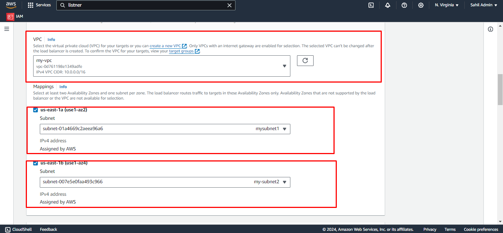

### Exercise4: Creating Load Balancer

To create the load balancer first you need to create the target group.
Follow the steps to create the target group.

(i) Navigate to target groups. 
(ii) Select create target group. 

 
Choose the target type as instances. 

 
Give the unique name for target group. 

 
Select the VPC which you have created. 

 
Click next. 

 
Choose the instances which you want to add in target group. 

 
Click on Create target group. 

### Steps to create the load balancer
 
Navigate to the load balancers and click on create load balancer. 

 
Choose the application Load balancer. 

 
Give the unique name to your load balancer. 

 
Choose the vpc and subnet which you have created. 

 
Select the Security group. 

 
Add target groups in Listners and routing. 

 
Click on Create load balancer. 

 
Now go back to dashboard to see the load balancer which you have created. 

----
Congratulations!, You have successfully completed the lab.
