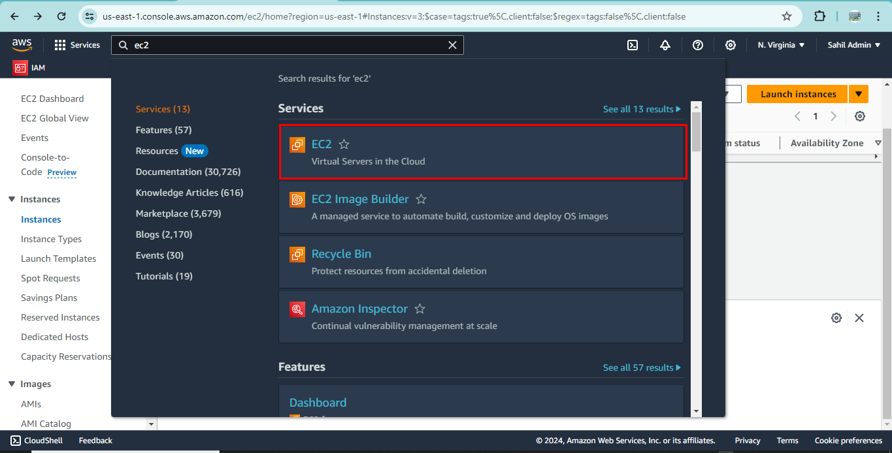
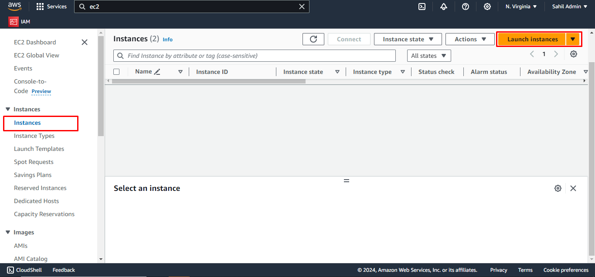
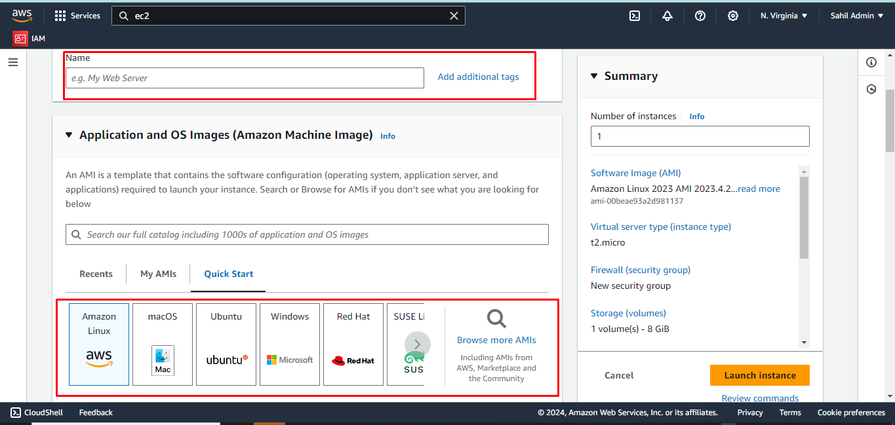
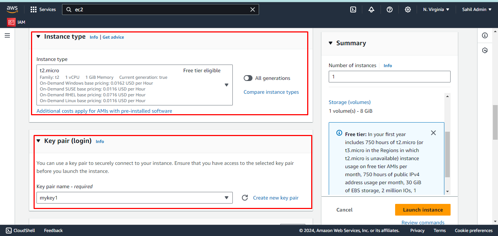
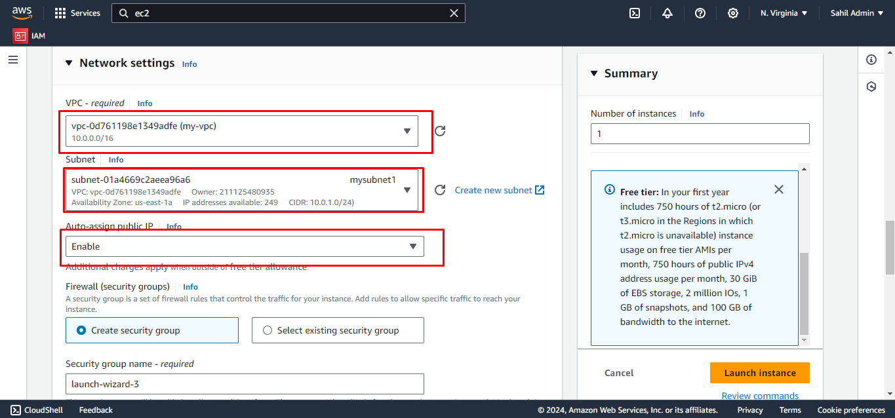
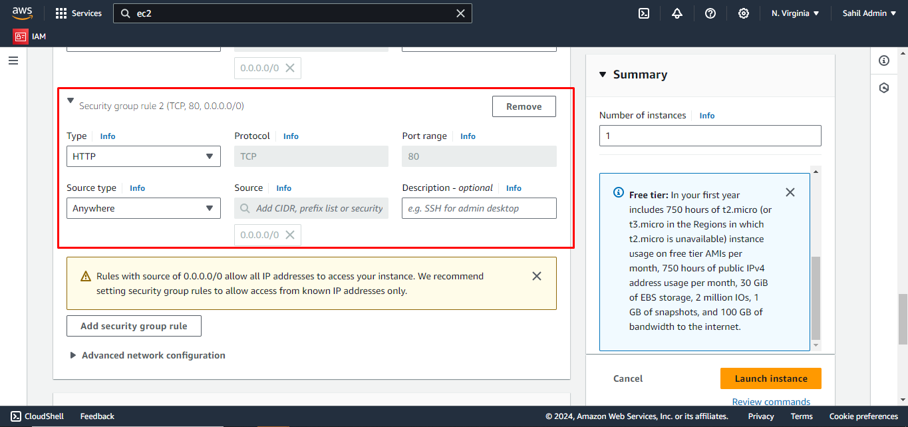
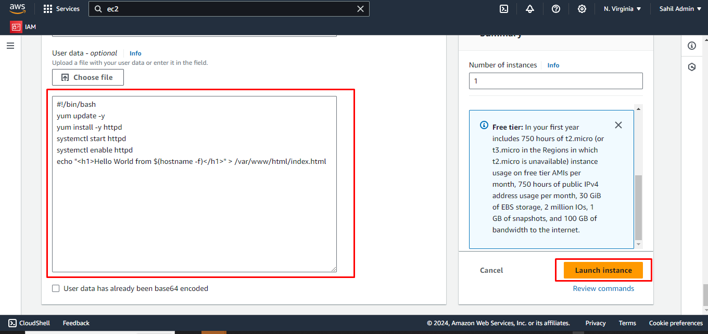
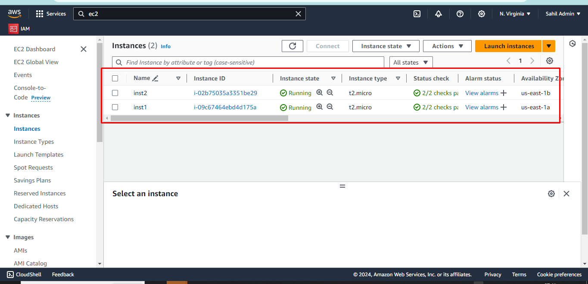

### Exercise3: Create EC2 

For checking, Load Balancer is working properly or not we have to launch two instances in different subnets.

Follow the steps to launch the instances:

Search for the service ec2 and press Enter

Navigate to instances and click on Launch instances.

Give the unique name for ec2 instance.
Select the image.

choose the instance type and key pair.

(i) Select the vpc which you have created.
(ii) Select the subnet
(iii) Enable the public ip.

Add the security groups.

Add the above script so that we can see later that the traffic is routing to different subnet or not.

Now Launch one more ec2 in diff subnet.

You have Successfully created the two ec2 instances.
