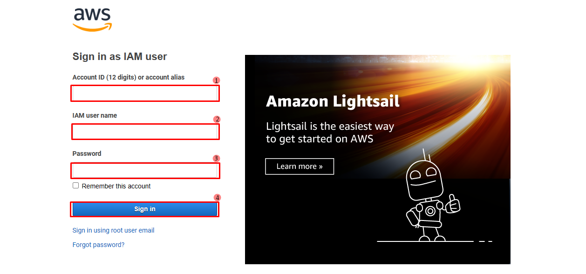

<h1 style="text-align: center;">Introduction to Elastic Load Balancer  (ELB)</h1>

**Lab Duration** :- 1hr

  ----
  

An Elastic Load Balancer (ELB) is a service provided by Amazon Web Services (AWS) that automatically distributes incoming application traffic across multiple targets, such as EC2 instances, containers, and IP addresses, in one or more Availability Zones. ELBs help ensure a high level of availability and fault tolerance for your applications.

## Types of Elastic Load Balancers

AWS provides three types of load balancers:

### Application Load Balancer (ALB)
- Ideal for HTTP and HTTPS traffic.
- Operates at the application layer (Layer 7) of the OSI model.
- Supports advanced routing capabilities based on request attributes, such as URL path or hostname.
- Suitable for microservices and container-based applications.

### Network Load Balancer (NLB)
- Designed for TCP, UDP, and TLS traffic.
- Operates at the transport layer (Layer 4) of the OSI model.
- Capable of handling millions of requests per second with ultra-low latency.
- Best suited for applications that require extreme performance and low latency.

### Classic Load Balancer (CLB)
- Supports both HTTP/HTTPS and TCP traffic.
- Operates at both the application and transport layers.
- Legacy option, recommended to use ALB or NLB for new applications.

## How ELBs Work

### Listeners
- A listener is a process that checks for connection requests. It is configured with a protocol and port number.
- ELBs support multiple listeners for different traffic types (e.g., HTTP, HTTPS).

### Target Groups
- Target groups route requests to one or more registered targets (e.g., EC2 instances).
- Health checks are performed on targets within a target group to ensure only healthy instances receive traffic.

### Health Checks
- Periodic health checks are performed to monitor the status of targets.
- Unhealthy targets are automatically removed from the routing pool until they recover.

## Getting started with Amazon ELB
  
Follow the steps below to get started with the lab.
  
1.Sign in to the AWS Management Console by copying the  **Sign-in link**, **Username**, and **Password** provided below.

Or just click [AWS Console](https://aws.amazon.com/console/ )

  - Sign-in Link: https://aws.amazon.com/console/
  - IAM Username:
  - Password:

  