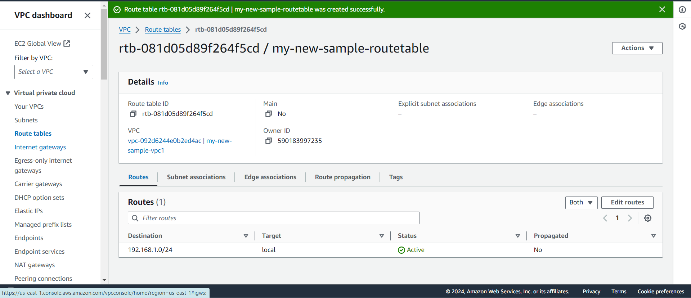

### Exercise2: Create two SUBNET
Now select **Subnets** from left panel and click ***create subnet*** present on top right.

 

Now Follow the steps as shown below 

i.Select VPC you have created for you subnet and Click create subnet 

 

 

In Subnet Settings, 

 
  i.Give unique name to your subnet 

  ii.Select the diff availbility zone for both the subnets. 

  iii.Select the IPv4 CIDR that you have created for VPC 

  iv.Now Give IPv4 CIDR for your subnet. 

 
Click on create Subnet and once you create the subnet 
successfully. 
create one more subnet in same vpc but in diff availbility zone. 

 

Now back to dashboard to see the subnets that is created. 

---
#### Creating Route Tables
Follow the steps for creating route table. 

 

select **Route Tables** from left panel and clik ***create Route Table*** present on top right. 

 
i.Give unique name to your Route table 

ii.Select the VPC you have created to associate it with route table. 

 
Click Create Route Table. 

 
Route Table created Successfully 
  
You will see the Route table in dashboard 
  
---
#### Creating Internet Gateway
Follow the steps for creating Internet Gateway. 

 
Select **Internet Gateway** from left panel and clik ***create Internet Gateway*** present on top right. 

 
(i) Give a unique name to your Internet gateway 
(ii) Click on Create Internet Gateway 
  
Once the creation is done attach *internet gateway* to VPC that you have created
Now Follow the steps as shown below: 

To Attach, 
  i.Click on Attach VPC on top right corner 

 

Select the VPC that you have created 

 

Clcik on attach Internet Gateway 

 
  
---
##### Edit Routes
Now back to **Route Table** and select **Routes** and perfom the action as shown 

Click Edit Routes 

 

Then Click Add Routes 

 

i. In destination select the item as shown in image. 

ii. In Target select *Internet gateway* and the internet gateway you have created. 

Click on *Save changes* 

 

##### Subnet Association
In **Route Table** select **Subnet Association** and perform the action as shown: 

 
Click Edit Subnet Association 

 

(i) Check mark the subnet . 
(ii) Click on *Save Association*. 

---
Now Again back to **your VPC** and select the VPC that you have created and panel that appears at bottom shows the ***Resource Map*** 

 
  
You have Successfully created the complete **VPC** with subnets,Route Table and Internet gateway which were not present before.
  
