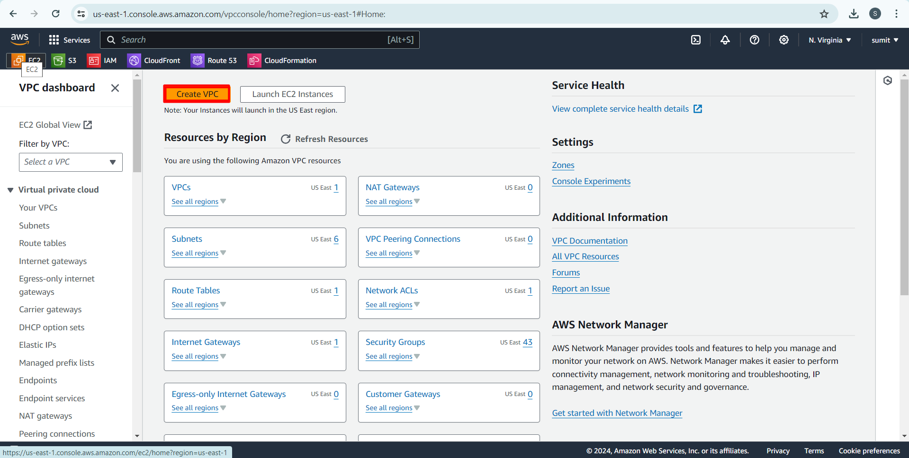
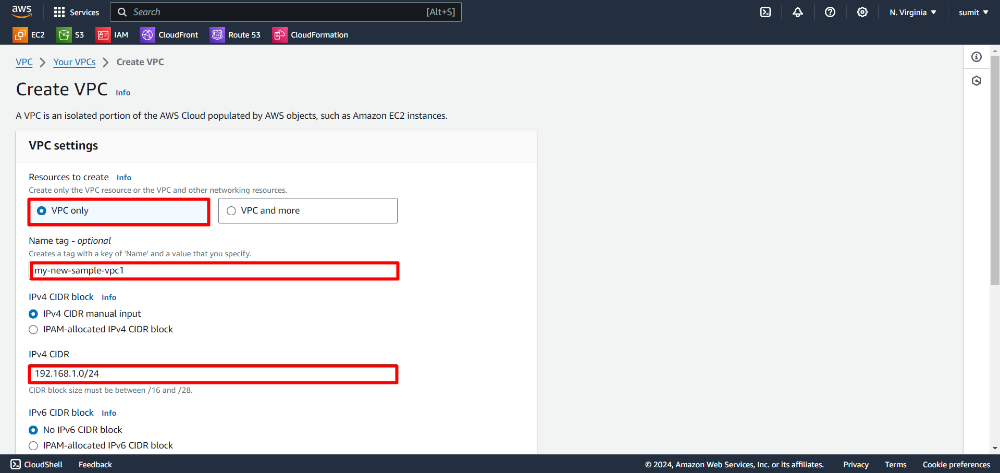
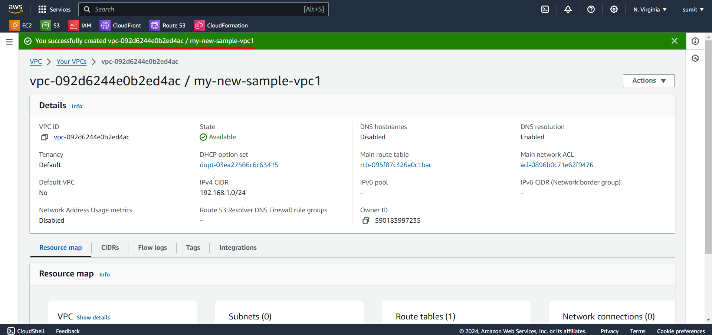

### Exercise1: Create vpc

<strong>Fig1.1</strong> Search for the service VPC and press Enter

  

<strong>Fig1.2</strong> After selecting VPC you will see VPC dashboard.

<strong>Fig1.3</strong> Now in top right corner select the region you want your VPC to be created.

  

<strong>Fig1.4</strong> Now click on Create VPC button on the screen.

Creation of VPC done in *Two ways* '

- [VPC only](#section6)  
- [VPC and more](#section7)
  
##### VPC Only{#section6}
select **VPC only** 

<strong>Fig1.5</strong> click on Create VPC button

Once the creation done properly you will see the vpc created successfully

  
*Successfully created VPC using VPC Only*